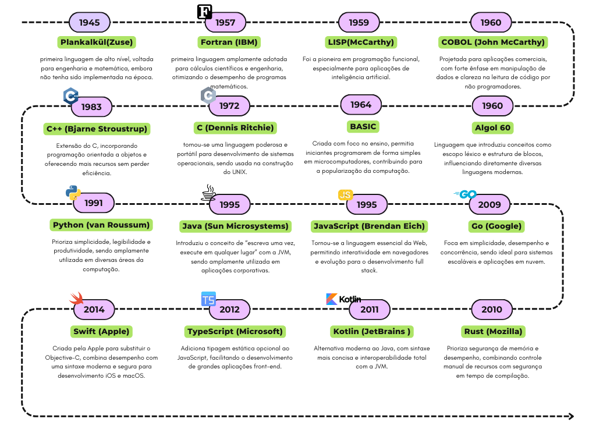

# 01 – Introdução

## Contexto e Motivação

A disciplina de Linguagens de Programação estuda não apenas a forma como instruções são codificadas, mas também os princípios teóricos que sustentam sua evolução, suas estratégias de execução e os paradigmas adotados pelas comunidades de desenvolvimento. Nessa introdução exploraremos sobre o surgimento e o amadurecimento das linguagens, de seu contexto histórico até as tendências emergentes, permitindo compreender como escolhas de design acompanham necessidades técnicas e sociais.

## Seleção e Destaques
- Foram Priorizadas as linguagens que introduziram novos conceitos (alto nível, programação funcional, orientação a objetos, tipagem estática, concorrência, segurança de memória etc.).  
- Também foram priorizadas as alternâncias entre grandes marcos acadêmicos e linguagens de adoção massiva para ilustrar tanto avanços teóricos quanto efeitos práticos no mercado.  
- **Plankalkül** e **Fortran** ficam de ponta a ponta do primeiro grande salto: do conceito de linguagem de alto nível ao uso industrial.  
- **LISP** e **Algol 60** trazem, respectivamente, os paradigmas funcional e estruturado, verdadeiros alicerces de gerações posteriores.  
- **COBOL** e **BASIC** representam a popularização do uso de linguagens de alto nível fora de ambientes acadêmicos: COBOL focou em aplicações de negócios com sintaxe próxima do inglês, enquanto BASIC abriu portas para iniciantes em microcomputadores.  
- **C** e **C++** ilustram a evolução dos sistemas operacionais e da orientação a objetos em código de baixo nível.  
- A curva até **Python** e **Java** mostra a preocupação crescente com legibilidade, portabilidade e escalabilidade corporativa.  
- **JavaScript**, embora inicialmente criado para scripts em navegadores, tornou‑se onipresente na web; seu nome decorre de uma estratégia de marketing que associou a nova linguagem ao então popular Java, mesmo sem compartilharem mais do que a sintaxe superficial.  
- Por fim, **Go**, **Rust**, **Kotlin**, **TypeScript** e **Swift** representam esforços recentes de segurança, tipagem e produtividade, refletindo demandas atuais por confiabilidade e rapidez de entrega.  
- Outras linguagens não mencionadas (por exemplo, Ruby, Erlang, Haskell) ficaram de fora devido ao foco em vertentes que deram origem às tecnologias e frameworks mais usados hoje.  

## Linha do tempo

