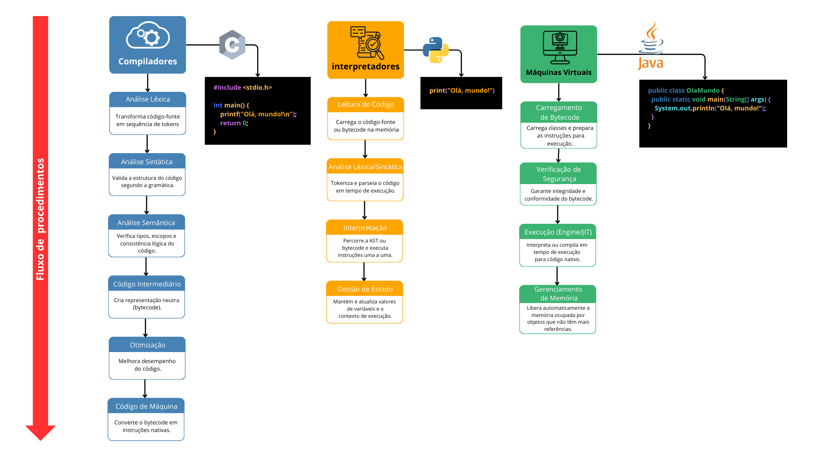

# 02 – Ambientes

## Contexto e Motivação

Ambientes de programação são as estruturas que transformam código‑fonte em programas executáveis, seja por meio de compilação antecipada, interpretação passo a passo ou execução em uma camada virtual. Neste tema, detalharemos o funcionamento interno de compiladores, interpretadores e máquinas virtuais, destacando o percurso do código‑fonte até sua execução.

## Compiladores 
Compiladores são programas responsáveis por transformar, de forma antecipada, o código-fonte escrito em linguagens de alto nível em um formato que pode ser executado diretamente pela máquina, como binários nativos ou código intermediário (bytecode). No processo de compilação, o compilador analisa o texto, verifica possíveis erros e otimiza instruções para obter o melhor desempenho na arquitetura alvo.

- **Exemplo em C:** ao utilizar o `gcc` em um projeto em C, todo o código-fonte é traduzido para um executável que roda diretamente no sistema operacional. O `gcc` aplica diversas otimizações para melhorar velocidade de execução e reduzir o tamanho do programa, detecta erros de sintaxe e tipo durante a compilação e produz um artefato pronto para ser distribuído e executado sem a necessidade de traduções adicionais.

## Interpretadores
Interpretadores são programas que processam o código-fonte ou um formato intermediário (bytecode) linha a linha ou bloco a bloco, traduzindo e executando instruções em tempo de execução, sem gerar um binário separado. Eles são úteis para desenvolvimento rápido e depuração, pois refletem imediatamente mudanças no código.

 - **Exemplo em Python:** ao rodar `python script.py`, o interpretador CPython lê o código-fonte, converte-o em bytecode em memória e executa esse bytecode diretamente, gerenciando variáveis e o fluxo de controle sem precisar de compilação prévia.

## Máquinas Virtuais
Máquinas virtuais (VMs) são camadas de software que executam bytecode de forma portátil, abstraindo detalhes de hardware e garantindo segurança e isolação. As VMs frequentemente incluem um compilador Just‑In‑Time (JIT) que traduz trechos de bytecode para código nativo em tempo de execução, além de serviços como coleta de lixo.

- **Exemplo em Java:** após compilar um programa Java com `javac` para gerar arquivos `.class`, a JVM carrega esse bytecode, verifica sua integridade, aplica otimizações JIT e executa o código nativo na plataforma de destino, cuidando também da limpeza de memória automática.

## Diagrama
Abaixo está o diagrama que apresenta graficamente todas as principais etapas abordadas neste README. Ele ilustra o fluxo de processos de compilação, interpretação e execução em máquina virtual, com exemplos de linguagens.

