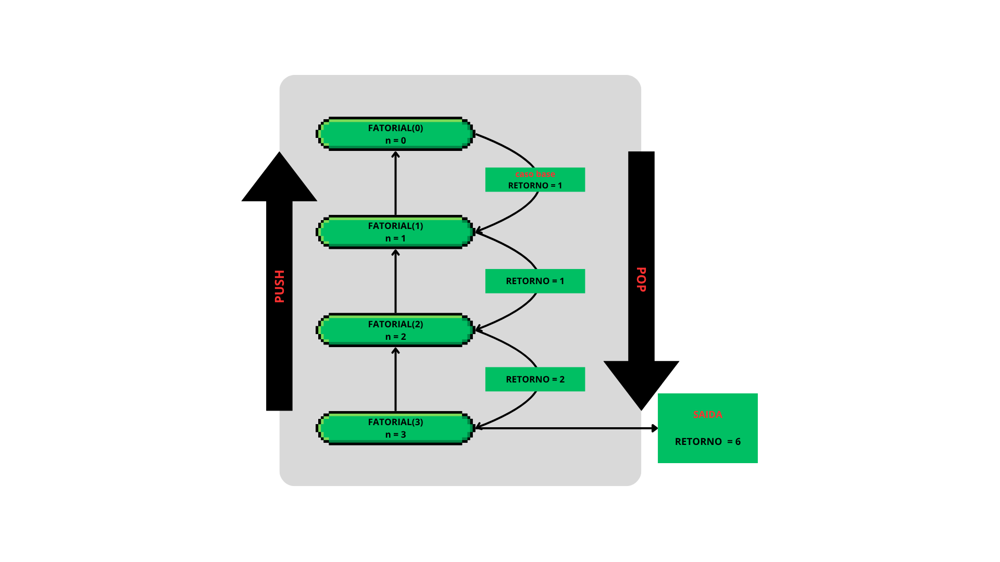

# 7 - Implementação de Subprogramas

### Contexto e Motivação
Agora iremos mergulha em um nível mais profundo: como de fato os subprogramas são implementados e gerenciados pelo ambiente de execução. Compreender o mecanismo por trás das chamadas de função é fundamental para depurar erros complexos, otimizar o uso de memória e até entender vulnerabilidades de segurança.
O pilar dessa implementação é a **Pilha de Chamadas (Call Stack)**, uma estrutura de dados que orquestra o fluxo de execução do programa. Para desmistificar seu funcionamento, utilizaremos um exemplo clássico de recursão o **cálculo de fatorial**, que expõe de forma clara e elegante o ciclo de vida de um subprograma na memória.

### A Pilha de Chamadas
A Pilha de Chamadas é uma estrutura de dados do tipo **LIFO (Last-In, First-Out)**, o que significa que o último subprograma a ser chamado é o primeiro a ser concluído. Ela funciona como uma pilha de pratos: novos pratos (chamadas de função) são adicionados ao topo, e apenas o prato do topo pode ser removido.
Cada vez que uma função é invocada, um **quadro de ativação** (stack frame ou activation record) é criado e "empurrado" (pushed) para o topo da pilha. Este quadro é um bloco de memória que contém todas as informações essenciais para a execução daquela instância específica da função:

- Argumentos e Parâmetros: Os valores que a função recebeu.

- Variáveis Locais: As variáveis declaradas dentro do escopo da função.

- Endereço de Retorno: O ponto exato no código para onde a execução deve voltar assim que a função terminar.

- Ponteiro de Controle: Um ponteiro para o quadro de ativação da função chamadora, mantendo a cadeia de chamadas intacta.

- Valor de Retorno: Um espaço reservado para armazenar o resultado que será devolvido.

Quando a função termina, seu quadro de ativação é "desempilhado" (popped), liberando a memória e devolvendo o controle (e o valor de retorno) para a função anterior, que agora está no topo da pilha.

### Exemplo Prático: A Recursão do Fatorial
A recursão é o exemplo perfeito para visualizar a pilha em ação. Cada chamada recursiva cria um novo quadro, empilhando contextos de execução até que uma condição de parada (o caso base) seja atingida.

### Código de Exemplo em Python:
```python
def fatorial(n):
  # Condição de parada (caso base) para evitar recursão infinita.
  if n == 0:
    return 1
  # Passo recursivo: a função chama a si mesma com um novo argumento.
  else:
    return n * fatorial(n - 1)

# Ponto de entrada da execução
resultado_final = fatorial(3)
```

### Análise da ilustração da Pilha de Chamadas
A ilustração que criei demonstra o ciclo de vida completo da execução de fatorial(3). O processo é dividido em duas fases distintas, que são mostradas abaixo:



#### Fase 1: Empilhamento (Push)
Nesta fase, a pilha cresce a cada chamada recursiva até que o caso base seja alcançado.

1. **Chamada `fatorial(3)`:** A execução começa. Um quadro para `fatorial(3)` é empurrado para a base da pilha. Como `n` é `3`, a função pausa e aguarda o resultado de `fatorial(2)` para poder `calcular 3 * resultado`.

2. **Chamada `fatorial(2)`:** Um novo quadro para `fatorial(2)` é empurrado ao topo. Com `n` igual a `2`, ela também pausa e aguarda o resultado de `fatorial(1)`.

3. **Chamada `fatorial(1)`:** O processo se repete. O quadro de `fatorial(1)` é adicionado, e a função aguarda o resultado de `fatorial(0)`

4. **Chamada `fatorial(0)`:** O último quadro é empurrado, com `n` igual a `0`. Esta chamada atinge o **caso base**. Ela não precisa fazer novas chamadas e pode retornar um valor diretamente. Neste ponto, a pilha atingiu sua altura máxima.

#### Fase 2: Desempilhamento (Pop)
Com o caso base resolvido, a pilha começa a encolher, e os resultados são propagados de volta, resolvendo as computações pendentes.

1. **Retorno de `fatorial(0)`:** A função retorna o valor `1`. Seu quadro é desempilhado (removido).

2. **Retorno de `fatorial(1)`:** A execução volta para `fatorial(1)`, que estava aguardando. Ela recebe o valor `1` e realiza seu cálculo pendente: `1 * 1 = 1`. Agora, `fatorial(1)` retorna `1` e seu quadro é removido.

3. **Retorno de `fatorial(2)`:** O controle volta para `fatorial(2)`. Ela recebe o `1` (de `fatorial(1)`) e calcula `2 * 1 = 2`. Retorna `2` e seu quadro é desempilhado.

4. **Retorno de `fatorial(3)`:** Finalmente, a execução retorna à chamada original. `fatorial(3)` recebe `2` e calcula o resultado final: `3 * 2 = 6`. Após retornar `6`, seu quadro é removido.

5. **Pilha Vazia:** A pilha está novamente vazia. O programa concluiu a computação do fatorial.

### Implicações Práticas e Conclusão
Entender a pilha de chamadas não é um exercício puramente teórico. Este conhecimento tem implicações diretas na programação diária:

- **Gerenciamento de Memória:** A pilha automatiza a alocação e desalocação de memória para variáveis locais, um processo que em linguagens como C precisaria ser manual se não fosse por esse mecanismo.

- **Debugging:** Quando um programa falha, o stack trace (rastreamento de pilha) que é exibido é um "retrato" da pilha de chamadas no momento do erro, mostrando a sequência de funções que levaram ao problema.

- **Limitações e Riscos:** A memória da pilha é finita. Uma recursão infinita ou profunda demais pode esgotar esse espaço, causando o famoso erro de Stack Overflow (estouro de pilha).
